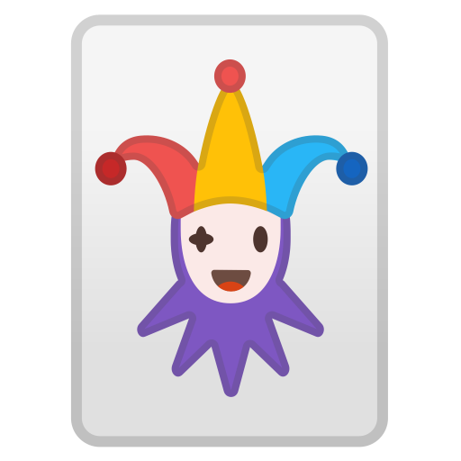

# School Of Code Week 8 Project 

## The J.K.R.S 

(Jones.Kudev.Randle.Swann)

### Problem :question:

We were tasked with building an app which would enchance the mentoring experince for both a mentor and mentee.

### Our Solution :bulb:

Drawing from our own experince as both mentors and mentees we decided to make an app that would help with contact between mentor and mentee.
We found that some people don't know what level of relationship a mentor mentee should be as well not knowing what to talk about (particularly at the beginning).

##### This made us create...

### PlusMentor

PlusMentor has various features designed to smooth the transition:
 
Introduction
 
Ice Breakers
 
Talking Points
 
Your Sessions

#### Home Page :house:

To access page you need to log in to the app, if you have an account just press the `Log In` button and type your email and password into the fields. 
 
 

OR if you don't have an account just regisiter (no problem) 
 
Just click `Create An Account` type in your email, first name, surname, create a password and select if you are a mentor or mentee (bootcamper). Then use that email and password on the login page.
 
 

#### Introduction :wave:

The introduction page is designed to help with first contact between mentor and mentee, trying to make sure you get of on the right foot. The page is set up like a checklist, this is where you can set up your email/conversation of the initial meeting. Even suggests for how to stay in touch zoom, email, in person and even recommended how long (30 mins/1 hour).
 
 

#### Ice Breakers :hammer:

The ice breaker page is designed to help with starting a dialogue, it has sample questions covering all different aspects of kind of relationship you may have can be established by the response.
 Some professional questions(their career):briefcase:
 Some more relaxed questions (hobbies and interests):musical_keyboard:
 Or even controversional (do they like marmite?):confounded:
 
 

#### Talking Points :telephone:

The talking points page we designed to be help with things you may not have even considered. The page has a button on it that when clicked gives a comment or question that you may not even realised you wanted the answer to. Maybe career path questions or even risk taking doubts.
 
 

#### Your Sessions :date:

The your sessions page is designed to help track what you discuss and when. The your sessions feature could be used like a journal. The page has some input fields on it as well some buttons. Let say that mentor mentee spoke on a particular day about the basics of JavaScript to help with this they did some codewars Katas together.
 
 

 
 
On the your session page in the topic input field "JavaScripts Basics" could be added with "Did Codewars Katas to go over some soft skills" added into discussion input field and click `Submit New Card` button, this would add to collection with the date onto it. This could be relevant if you wanted to refer back to something maybe a topic that the mentee was struggling with and revisit the discussion.
 
 
The cards can then be displayed with `See All Cards` button (The `See your cards` is usefull if you have more than one mentor/mentee as you can see cards specific to one person).
 
 

### The How? :pencil2:

We used various technologies to PlusMentor:
 React & React-Router-Dom for main app functionality and link through the pages
 Bulma for CSS :art:
 JS-Cookie and React-Cookie for users access the site :cookie:

## What to see? :eyes:

If you want to PlusMentor you can open a localHost version by typing "npm run start" in the terminal
 

### Or a deployed version :computer:

https://plusmentor.netlify.app/
